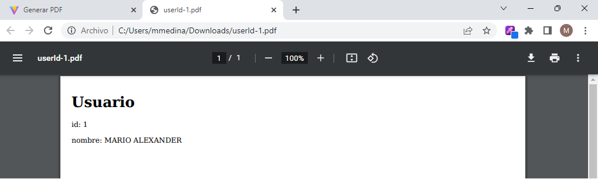

# Guía de inicio rápido: Generar PDFs con pdfkit

Esta guía de inicio rápido demuestra cómo generar PDFs utilizando Mysql, Django y React. Primero 
[instala Compose](https://docs.docker.com/compose/install/).

#### Data


#### Formulario Web


#### PDF generado



### Software utilizado

```
Django==4.1.5
django-cors-headers==3.13.0
djangorestframework==3.14.0
djangorestframework-simplejwt==5.2.2
pdfkit==1.0.0
mysqlclient==2.1.1
Mysql==8
node==18.3
react===18.2.0
vite===4.1.0
```

## Instalar y configurar pdfkit

```
pip install pdfkit
```

En archivo settings.py
```
import pdfkit

WKHTMLTOPDF_CMD = '/usr/bin/wkhtmltopdf'
PDFKIT_CONFIG = pdfkit.configuration(wkhtmltopdf=WKHTMLTOPDF_CMD)
```

## Deploy con docker compose

```
$ docker compose up -d
```

## Resultados esperados

La lista de contenedores debe mostrar tres contenedores en ejecución y la asignación de puertos como se muestra a continuación:
```
$ docker ps
CONTAINER ID   IMAGE                           COMMAND                  CREATED          STATUS                    PORTS                               NAMES
85701f66ccf8   react_django_mysql01-frontend   "docker-entrypoint.s…"   3 minutes ago    Up 10 minutes             0.0.0.0:3000->3000/tcp              docker_react
68f7e15d4d9e   react_django_mysql01-web        "bash -c 'python3 ma…"   3 minutes ago    Up 10 minutes             0.0.0.0:8085->8000/tcp              docker_django
87b16828263a   mysql:8                         "docker-entrypoint.s…"   3 minutes ago    Up 11 minutes (healthy)   33060/tcp, 0.0.0.0:3308->3306/tcp   docker_db
```

Luego vaya a `http://localhost:3000/` en su navegador web.